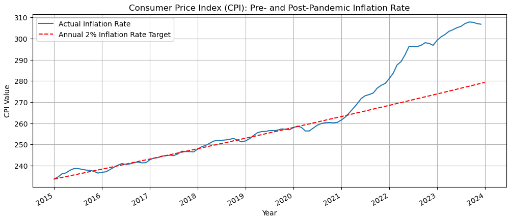
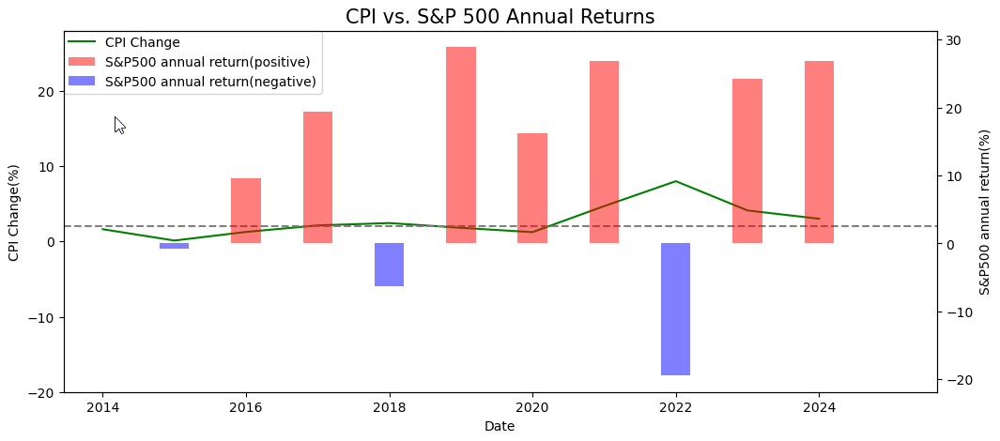
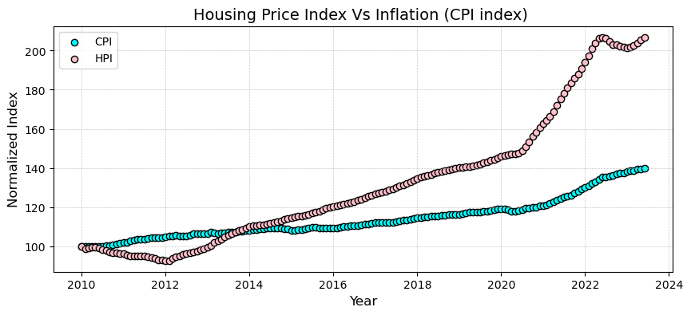
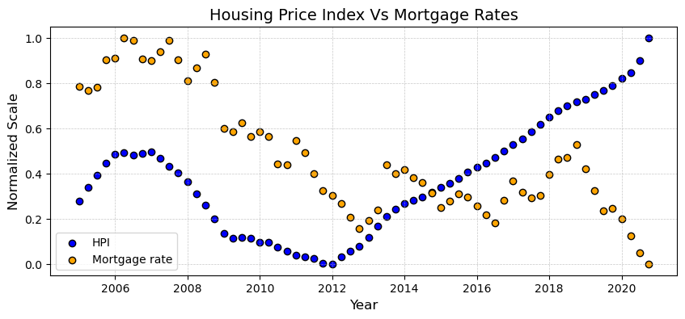
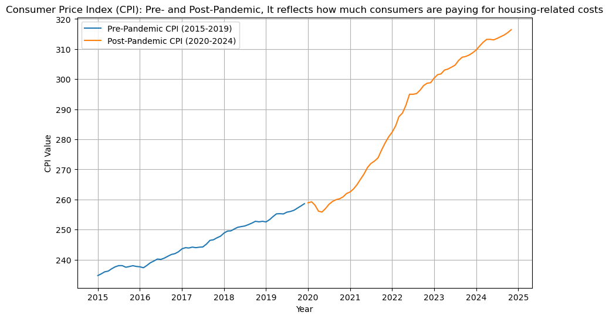
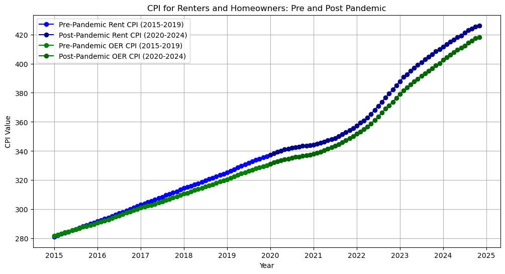
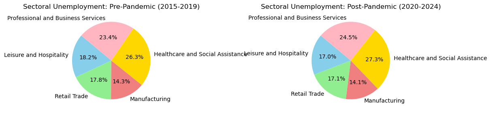
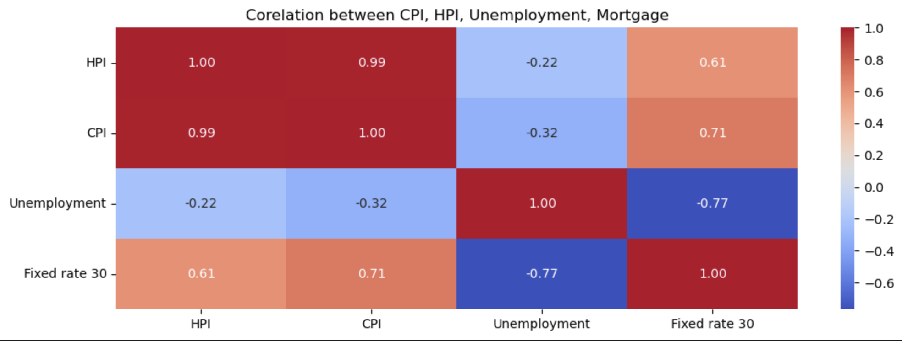

# The Big Squeeze: The Effect of Inflation on Housing, Unemployment and the Stock Market

## **Project Overview**

### *Package Requirements and Versions*

`pip install x` ; where 'x' is the package listed below:
* `python == 3.7.13+` 
* `pandas == 2.2.2`
* `hvplot == 0.7.3`
* `matplotlib == 3.5.1`

### *File Navigation, Installation & Usage*

**File Navigation**

* Code: Code - Directory containing all of the the code
  * CPI vs S&P 500 Performance Analysis 
    * Navigate to [Link to CPI vs S&P 500 Analysis](Code/cg_analysis.ipynb)    
  * CPI vs HPI Analysis
    * Navigate to [Link to CPI vs HPI Analysis](Code/mn_analysis.ipynb)
  * Pre- and Post-Pandemic Economic Trends
    * Navigate to [Link to Pre- and Post-Pandemic Economic Trends](Code/la_analysis.ipynb)
  * CPI vs HPI vs Unemployment vs Mortgage Trends 
    * Navigate to [Link to CPI vs HPI vs Unemployment vs Mortgage Trends](Code/xf_analysis.ipynb)
* Content: 
  * Navigate to [link](Resources/content) - Directory containing all images of plots created in Jupyter Notebook and demos.
* Data: 
  * Navigate to [link](Resources/data) - Directory containing all of the csv files used by the code

**Installation**
  * Clone the repository from here.. [Clone Me](https://github.com/xraySMULu/the-big-squeeze.git) 

**Usage**
  * Open Jupyter notebook, click 'Run all' to execute all code blocks.

### *Purpose of Use*   
Our team decided to research the effects of inflation during during a Pre- and Post-Pandemic date range, investigating true inflation percentage, annual inflation against a 2% average, inflation and the effects of S&P 500 performance, how the consumer price index (CPI) reflects house related costs, unemployment rate, correlation between inflation and the Housing cost, the impact of Housing cost on Foreclosures & Mortgage rates and the overall correlation between these indicators.

The business question we hope to answer is: *What are the key interrelationships between inflation, housing market dynamics, unemployment, stock market and how have these relationships have evolved over time?*

Our motivation for taking on this challenge is to find out if there is clear causation, or merely a correlation, between the effect of inflation on housing, unemployment and the S&P 500.

The periods of inflation analyzed include:
* Data Dates: 
  * Pre-Pandemic: 2015-2019
  * Post-Pandemic: 2020-2023

## Data Pre-Processing/Gathering Steps
Our team accessed inflation data from Kaggle, the U.S. Bureau of Labor Statistics (BLS), and the U.S. Department of Labor to analyze trends and visualize key economic metrics.

* CPI vs GDP 500 Performance Analysis
  * We accessed CPI data from the U.S. Bureau of Labor Statistics. Using the Python pandas module along with the CPI library, we leveraged the Consumer Price Index for North America. The data underwent basic preprocessing, including defining the start range and specifying the number of periods in the range. To analyze inflation trends, we calculated a 2% annual inflation increase and plotted it alongside the CPI progression. Additionally, we plotted the actual inflation percentage against the average using the same dataframe. We then used the S&P 500 dataset and compare CPI Change percentages against S&P 500 Performance data. All dataframes were visualized with line graphs, scatter plots, bar charts and a dynamic map created with Matplotlib.

* CPI vs HPI Analysis
  * We worked with time-series data in CSV format obtained from Federal Reserve Economic Data (FRED) and Kaggle. The dataset was cleaned by renaming and filtering columns for usability. We aligned timelines by slicing the dataframe and addressed missing data to ensure consistency. The data was indexed to 100 for comparison and visualized using scatter plots and heatmaps, generated with Matplotlib.

* Pre- and Post-Pandemic Economic Trends
  * We also accessed data from the Bureau of Labor Statistics, which offers yearly statistics via its public API and downloadable datasets. This analysis focused on two distinct time periods: pre-pandemic (2015–2019) and post-pandemic (2020–2024). Key metrics included the Housing CPI, reflecting housing-related expenses, and the Unemployment Rate, measuring the percentage of unemployed individuals in the labor force. The data was retrieved using the BLS API with specific series IDs and time ranges or downloaded as CSV or Excel files. These trends were analyzed to highlight housing inflation and changes in unemployment, visualized using line and pie charts.

* CPI vs HPI vs Unemployment vs Mortgage Trends
  * We gathered our time-series data from both Kaggle and the Federal Reserve of Economic Data in CSV format for it to be easier to read into our dataframes. After reading in the CSV files, we cleaned up the data by renaming colums as well as converting the "Date" columns into datetime format. We also filtered the columns to focus on the specfic data we wanted to look at and compare. We then sliced the dataframe to go along the same timelines. After all the data has been refined, it was graphed into visualizations. 

## Visuals and Explanations
* To depict the trends and analysis we used line graphs, bar charts, scatter plots and heatmaps. Below is a sample of each as well as the location of the code.

**Consumer Price Index (CPI): Inflation Rate**

The inflation rate during the -Pre and -Post pandemic period.

**CPI vs. S&P 500 Annual Returns**

The analysis of CPI vs. S&P 500 Annual Returns.

**HPI vs. CPI**

The analysis of HPI vs CPI.

**HPI vs Mortgage rates**

The analysis of HPI vs Mortgage Rates.

**Overall Consumer Price Index (CPI) related to House hold costs**

The trends of CPI vs Household costs.

**CPI breakdown of Renters and Owners**

The trends of CPI vs Renters and Owners.

**Breakdown of heavily impacted job sectors**

The trends of heavily impacted job sectors.

**Correlation between cpi, hpi, unemployment, and mortgage**

The correlation between cpi, hpi, unemployment, and mortgage.

## Additional Explanations and Major Findings

**Major findings**
* The correlation between inflation and the S&P 500 Performance is weak. 
* The correlation between inflation and housing is strong positive.
* The correlation between housing and foreclosures is strong negative.
* Inflation poses a dual challenge by undermining housing affordability and threatening job security, ultimately affecting overall economic well-being.
  
### CPI vs S&P 500

In continuing our investigation, we analysed S&P 500 Performance datasets and CPI datasets

**S&P 500** Performance has long been an excellent economic indicator of a good economy. With this, we explore the historical S&P 500 Performance compared to the inflation rate with a goal of finding a solid correlation.

**How does the actual inflation rate compare to the 2% average annual target, and what factors contributed to deviations during these periods?**

* The actual inflation rate is typically steady and compares closely with the 2% target. The 2% target is considered low enough to avoid price instability while still providing a buffer against deflation. The 2% target helps individuals and business plan for a future with a predictable price environment. Factors that caused a deviation in the inflation rate during the pandemic were the volitility of energy prices, backlog of work orders for goods and services caused by supply chain issues, and price changes in the auto-related industries.  

**CPI vs Annual S&P 500 Performance**

* Analyzing CPI vs S&P 500 Performance brought to light that strong or weak stock performance doesnt exactly equate to high or low inflation... but sometimes it does. Looking at the trends of both S&P 500 Performance in our plots, we found that positive S&P 500 annual returns kept the inflation rate at the 2% target. 

**Is there a correlation between CPI and annual S&P 500 Performance?**

* The trend seems to that the larger the rate of CPI increase, the worse the S&P 500 performs. This is not always true because some y-values are high even when the x-axis is large. Considering that most points do not follow or land near the regression as well as a -0.30 correlation value, I believe that a weak negative correlation exists between CPI % amd S&P Annual % Performance.

### HPI vs Inflation
To begin our investigation, we took a look at the consumer Price Index and Home price Index datasets. 

**HPI** is an indicator of the changes in the price of homes over time. It is calculated by comparing the price of homes in a particular area at different times. Whereas **Inflation** (measured by CPI), on the other hand, measures the overall increase in the prices of goods and services over time. 

**HPI vs Inflation Over Time**
* Analyzing HPI Vs CPI offers a critical understanding of how the housing market affects inflation. Looking at the trends of both Inflation and HPI in our plots, we found they move in the same direction and exhibits a strong correlation. Generally, when inflation rates rise, HPI tends to rise as well. This is because higher inflation rates tend to lead to higher interest rates, which in turn can increase demand for real estate as investors look for ways to protect their assets against inflation.

* While understanding the relationship between HPI and the Inflation, we decided to analyze the impact of housing prices on Mortgage rates and foreclosures as well since these indicators reflect the intricate dynamics of the housing market and broader economic factors. This led to the question,

**Does Mortgage Rates influence the HPI growth rate?**

* Our plots showed they exhibit an inverse relationship. As mortgage rates increase, borrowing becomes expensive, reducing house demand. This dampens HPI growth. On the other hand, lower mortgage rates reduce the cost of borrowing, making homes more affordable. This stimulates demand, leading to faster HPI growth. Further we decided to take up our next question, 

**Does the Home Price Index affect foreclosure rates?** 

* Our plots showed a strong negative correlation between these two indicators. 

* Declining home prices can lead to negative equity (When a homeowner owes more than their home's market value) increasing foreclosure rates. Borrowers in negative equity are less likely to refinance or sell. 

* As home value increases, homeowners build equity, reducing foreclosure risks. Homeowners with equity can sell or refinance to avoid foreclosures.

### Impact Of Inflation On Housing And Unemployment

**Consumer Price Index (CPI) Trends**
  * Displays the CPI for household-related costs over pre-pandemic and post-pandemic periods.
  * Post-pandemic CPI shows a sharp increase in rents, utilities, and maintenance costs compared to the steady rise before the pandemic.

 **CPI Breakdown for Renters and Homeowners**
  * Compares the CPI components for **renters** (Rent of Primary Residence, Utilities) and **homeowners** (Owners' Equivalent Rent, Maintenance Costs).
  * Post-pandemic inflation disproportionately increased costs for both renters and homeowners.

**Unemployment Rate Trends**
   * Shows unemployment rates during the pre-pandemic and post-pandemic periods.
   * Displays the overall unemployment rate during the pre-pandemic and post-pandemic periods.
   * Unemployment spiked sharply during the pandemic, reaching **14.7%** in 2020, but gradually recovered to around **4%** by 2024.
   * Inflation-driven economic policies, such as interest rate hikes, contributed to fluctuations in unemployment.
  
 **Sector-Specific Unemployment Trends**
   * Visualizes unemployment trends in key sectors such as **Leisure and Hospitality**, **Retail Trade**, **Manufacturing**, **Healthcare**, and **Professional and Business Services**.
   
 **Key Insignts** 
  * Housing Costs: Post-pandemic inflation led to a sharp rise in rents, home prices, utilities, and maintenance costs, impacting affordability for households.
  * Unemployment: Unemployment spiked in specific sectors during the pandemic and recovered gradually, but inflationary pressures continue to strain job stability.

### CPI vs HPI vs Unemployment vs Mortgage

* In finalizing our investigation we decided to see if there were any correlations between the 4 major things we discussed.
* CPI which is our inflation, HPI which covers the price of homes, Unemployment both pre and post pandemic, and Mortgage rates on houses over your typical 30 year plan.

**Is there a correlation between these 4?**

* Upon further investigation is seems that CPI, HPI, and Unemployment have some type of correlation with Mortgage rates. Both postive and negative correlations were found.
* CPI and HPI have a strong positive correlation with Mortgage rates.
* As inflation rises, homes prices follow which leads to an even higher Mortgage rate than normal.
* Unemployment has a strong negative correlation with Mortgage rates.
* As Unemployment goes down so do Mortgage rates.

**Boxplot**

* Mortgage rates seemed to be the only data range that had an outlier. 
* The reason for this is because there was a spike in mortgage rates and being that the data is pre and post pandemic we can estimate that this was around the time that inflation rose and mortgage rates rose alongside to combat inflation.

## Additional questions that surfaced and plan for future development

* Include more control variables for analysis 
* Use rolling windows to analyze how the relationship evolves over time. 
* Apply advanced models to test predictive relationships. 
* Implement lag effects.

## Conclusion

This research explored the intricate relationships among inflation, housing markets, and economic indicators, revealing significant insights into their dynamics. The correlation analysis between the Home Price Index (HPI) and CPI uncovered a satrong relationship.

The findings of this research emphasize the interconnected nature of inflation, mortgage rates, and housing market dynamics. Policymakers and economic stakeholders must recognize these relationships when designing interventions to ensure financial stability. Incorporating housing-specific metrics like HPI alongside broader inflation measures such as CPI can provide a more nuanced understanding of economic conditions.

## References

* U.S. Energy Information Administration
* Federal Reserve Economic Data
* U.S. Bureau of Labor Statistics
* chatgpt.com
* https://finance.yahoo.com/ - SP500
* https://fred.stlouisfed.org/series/CSUSHPISA* 
* https://fred.stlouisfed.org/seriesBeta/FPCPITOTLZGUSA - CPI yearly
* https://fred.stlouisfed.org/seriesBeta/CPIAUCSL - CPI monthly
* https://curvo.eu
* https://www.bls.gov/opub/mlr/2023/beyond-bls/what-caused-inflation-to-spike-after-2020.htm
* Coordinates of 50 states: https://gist.github.com/dikaio/0ce2a7e9f7088918f8c6ff24436fd035
